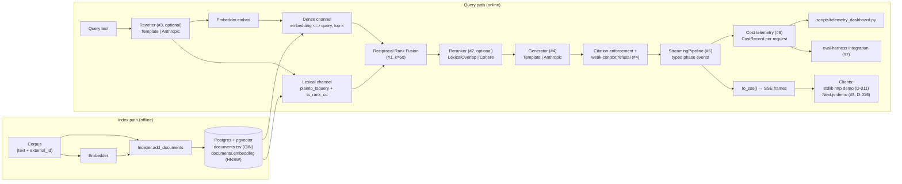
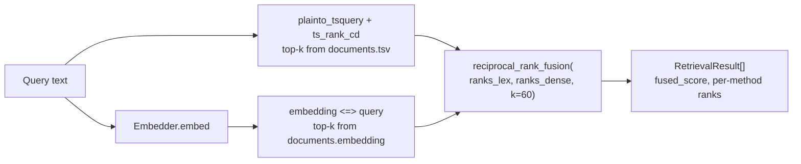
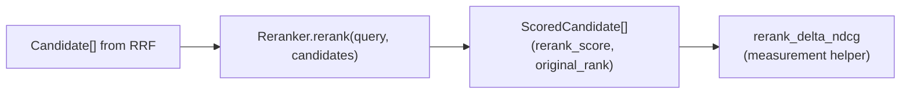
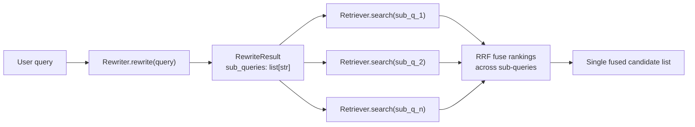
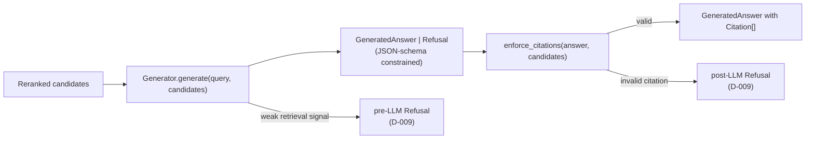
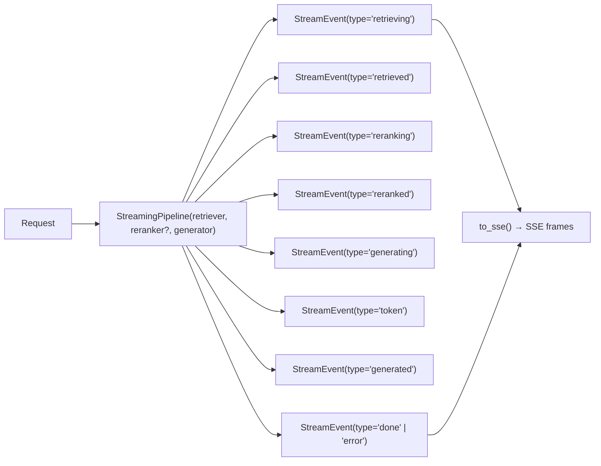
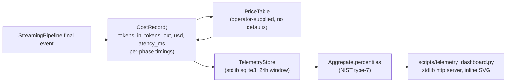
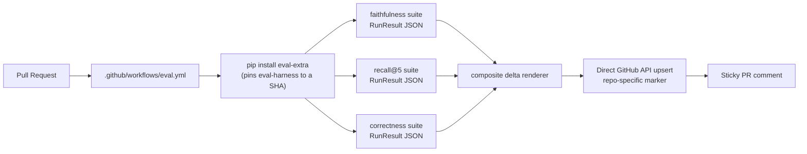
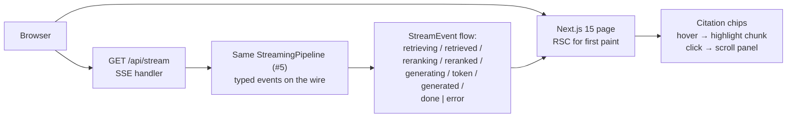

# Architecture

This kit is built layer-by-layer; each layer is adoptable on its own.
Eight runtime layers have shipped. The first half of this doc is the
integrated picture — how index and query paths compose at runtime — and
the second half is the per-layer detail with the design decisions behind
each one.

## Integrated request lifecycle

**Stack-level invariants.**

- The package's only required runtime dep is `psycopg` (D-002). Every
  other integration — Anthropic SDK, Cohere SDK, eval-harness — lives
  behind a PEP 621 extra so the core stays installable in restricted
  CI sandboxes.
- Pluggable Protocols at every seam where a backend can be substituted:
  `Embedder`, `Reranker` (D-005), `Rewriter` (D-014), `Generator` (D-008).
  Same single-method shape used across the portfolio so consumers can
  reuse the seam idiom.
- The streaming pipeline is a sync generator (D-010), not asyncio. Web
  framework integration is one adapter (`to_sse`); SSE is a wire format,
  not an architecture.
- All eight layers are exercisable in CI without an API key — the
  dep-free reference backends (`HashEmbedder`, `LexicalOverlapReranker`,
  `TemplateRewriter`, `TemplateGenerator`) cover the hermetic path.

---

## 1. Hybrid retrieval + RRF fusion

**What it does.** Runs two retrieval channels in parallel — Postgres
full-text search (`ts_rank_cd` over a GIN-indexed `tsv` column) and
pgvector ANN (`embedding <=> query` via HNSW) — then fuses them with
Reciprocal Rank Fusion so neither channel dominates.

**Composes with.** Sits at the bottom of the query path. Everything
that needs ranked candidates — rerank, generation, eval — reads from
`Retriever.search()`'s output.

**Why these decisions.**

- **D-003.** Dense vector dimensionality is configured per deployment;
  default 64 matches `HashEmbedder`. Production callers reset it on
  table init to match their real embedder.
- **D-004.** RRF with `k=60` from the original RRF paper. Returns
  per-method ranks alongside the fused score so consumers can debug
  *which channel* surfaced a doc — eyeball-debuggable wins beat a
  weighted-blend black box.

---

## 2. Cross-encoder reranking

**What it does.** Opt-in second pass that re-orders the top fused
candidates by a higher-quality relevance signal. Two backends ship:
`LexicalOverlapReranker` (dep-free; deterministic; hermetic CI default)
and `CohereReranker` (production, behind the `[cohere]` extra).

**Composes with.** `Retriever.search(reranker=…)` (D-007) — the kwarg
defaults to `None` so the existing hybrid-only path stays unchanged.

**Why these decisions.**

- **D-005.** `Reranker` is a single-method Protocol — same shape as
  `Embedder`. Consumers BYO backends without inheritance or registration
  overhead.
- **D-006.** `LexicalOverlapReranker` is the dep-free reference so CI
  exercises the rerank flow. Not "good"; just deterministic — quality
  belongs in the production backend, hermetic exercise belongs in CI.
- **D-007.** `reranker` kwarg defaults to `None` so callers opt in
  rather than discover a new step in their hot path.

---

## 3. Query rewriting / decomposition

**What it does.** Pre-retrieval step that turns one user query into 1..K
sub-queries. Useful for multi-hop questions ("compare A and B…") and
under-specified questions where a single embedding misses one facet.
Ships `TemplateRewriter` (rule-based, dep-free) and `AnthropicRewriter`
(production, lazy-imported via the existing `[anthropic]` extra).

**Composes with.** `Retriever.search(rewriter=…)` (mirrors the reranker
pattern). When the reranker is also wired, it scores against the
*original* user query, not any one sub-query.

**Why these decisions.**

- **D-014.** Rewriter is a single-method Protocol, dep-free default,
  Anthropic extra. Mirrors the embedder/reranker/generator pattern so
  one mental model covers all four seams.

---

## 4. Generator + citation enforcement + refusal

**What it does.** Produces a final answer with inline citations and
refuses cleanly when the retrieved context is too weak to answer. Two
backends: `TemplateGenerator` (dep-free reference, useful for hermetic
testing and the in-repo Next.js demo) and `AnthropicGenerator`
(production, structured-outputs JSON schema for `GeneratedAnswer | Refusal`).

**Composes with.** Reads `ScoredCandidate[]` from the reranker (or
directly from RRF). Writes the typed `Citation[]` the streaming layer
ferries to the client and the Next.js demo (#8) renders as chips.

**Why these decisions.**

- **D-008.** `Generator` Protocol with `TemplateGenerator` default and
  `[anthropic]` extra. Mirrors the reranker pattern; the demo and the
  hermetic tests can both exercise the citation-enforcement flow without
  an API key.
- **D-009.** Refusal is pre-LLM when the retrieval signal is weak
  (low fused score, low max similarity) and post-LLM when the model
  produced a citation that doesn't match any candidate chunk. Two
  failure modes, two checks, one `Refusal` type.

---

## 5. Streaming pipeline + SSE

**What it does.** Composes retriever → optional reranker → generator
into a sync-generator pipeline that yields a typed `StreamEvent` at
every phase boundary. `to_sse()` wire-formats the events for SSE; any
HTTP framework can wrap that. `PhaseTimings` records per-phase
wall-clock so a caller can compute p50/p95/p99 without instrumenting
the pipeline itself.

**Composes with.** Sits above the generator and below any HTTP layer.
Reused by both the Python stdlib demo and the Next.js demo (#8, D-016),
which speak the *same* SSE protocol.

**Why these decisions.**

- **D-010.** Sync generator, not asyncio. Asyncio buys nothing inside a
  pipeline whose blocking calls are already a wrapper over psycopg /
  the Anthropic SDK; the sync API composes with both async and sync
  callers via `iter(...)`.
- **D-011.** Demo HTTP server is `http.server` from the stdlib, not
  FastAPI. Demos in this repo show *the pipeline*, not the web layer.

---

## 6. Cost telemetry

**What it does.** Per-request cost and timing record (`CostRecord`)
captured at the end of the streaming pipeline, persisted to a
24-hour-window SQLite store, aggregated into p50/p95/p99 percentiles,
rendered by a stdlib-only HTTP dashboard.

**Composes with.** Reads only the streaming pipeline's final event;
doesn't need to know about retriever/reranker/generator internals.
Dashboard is independently runnable; eval harness (#7) reuses the same
`CostRecord` for cost-per-eval-row reporting.

**Why these decisions.**

- **D-015.** `PriceTable` ships no defaults; unknown model id raises
  `UnknownModelError`. Silent zero-cost is the worst failure mode for a
  cost telemetry surface — operators must declare the rates they're
  billing against. No fabricated benchmarks (handoff §10).

---

## 7. Eval-harness integration

**What it does.** Three suites — faithfulness, recall@5, correctness —
each writes one `RunResult` JSON via `eval-harness`. A composite PR
comment carries all three deltas under a repo-specific sticky marker.

**Composes with.** Reads the same retriever / reranker / generator
stack the production query path uses; the only swap is an in-memory
token-overlap retriever for the hermetic CI path so an Anthropic key
isn't required for the PR check.

**Why these decisions.**

- **D-012.** Composite PR comment goes through a *repo-specific* sticky
  marker, not the marker `eval-harness` defines for its own consumers.
  Avoids clobbering when two projects in the same fork use the same
  workflow.
- **D-013.** The eval corpus is single-sentence chunks so the
  `TemplateGenerator`'s "one citation per sentence" output satisfies
  `enforce_citations` deterministically. The choice keeps the eval path
  exercised in CI without an API key.

---

## 8. Next.js demo with inline citations

**What it does.** A Next.js 15 / React 19 demo served alongside the
existing Python stdlib demo. Identical SSE protocol. Citation chips
hover-highlight and click-scroll to the matching chunk in a side panel.
Production build is statically rendered root + dynamic API route for
the SSE stream.

**Composes with.** A second wire-compatible client of the streaming
pipeline. Catches the failure mode where the Python demo would work
end-to-end but the SSE shape was subtly different for a React consumer.

**Why these decisions.**

- **D-016.** The Next.js demo re-emits the same SSE protocol as the
  Python demo, not a new wire format. The streaming layer's job is to
  emit one canonical event shape; each demo is a thin renderer over it.

---

## Where to look next

- **Schemas** — `infra/postgres/init.sql` for the table layout
  (`documents.tsv` GIN + `documents.embedding` HNSW), `rag_kit/__init__.py`
  for the Python surface, `demo/nextjs/lib/streamer.ts` for the demo
  protocol shim.
- **Benchmarks** — `docs/benchmarks.md` and `scripts/bench_streaming.py`,
  `scripts/bench_rewriter.py`.
- **Telemetry** — `rag_kit/telemetry.py`,
  `scripts/telemetry_dashboard.py`.
- **Design decisions** — `MEMORY/core_decisions_human.md` for prose,
  `MEMORY/core_decisions_ai.md` for the structured log.
