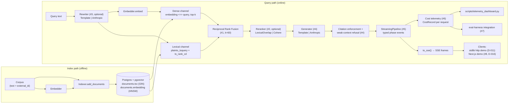
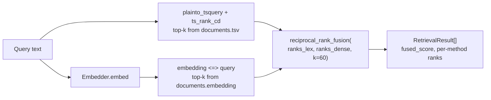
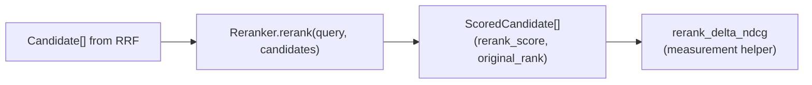
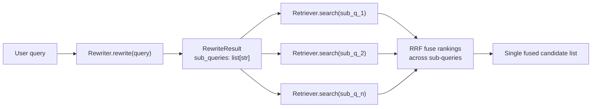
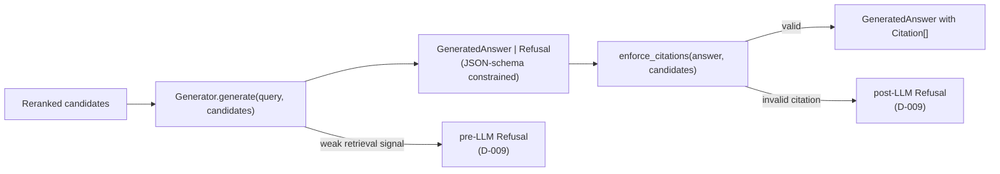
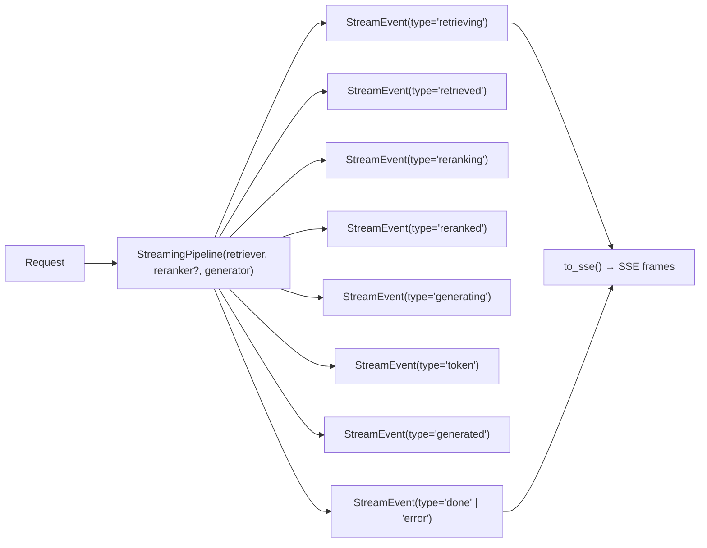
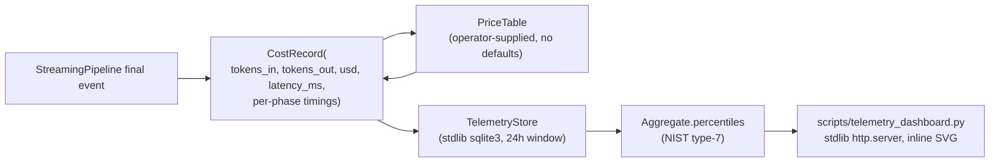
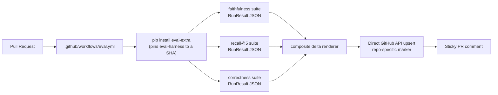
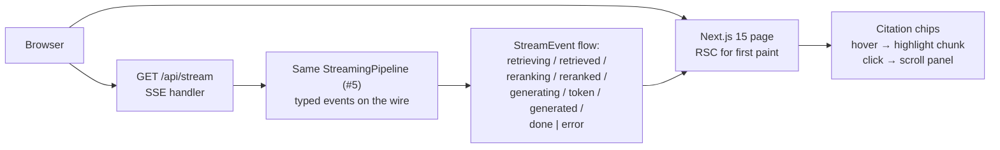

# Architecture

This kit is built layer-by-layer; each layer is adoptable on its own.
Eight runtime layers have shipped. The first half of this doc is the
integrated picture — how index and query paths compose at runtime — and
the second half is the per-layer detail with the design decisions behind
each one.

## Integrated request lifecycle

```mermaid
flowchart LR
    subgraph IDX["Index path (offline)"]
        CORP["Corpus<br/>(text + external_id)"] --> EMB1[Embedder]
        CORP --> IDXR[Indexer.add_documents]
        EMB1 --> IDXR
        IDXR --> PG[("Postgres + pgvector<br/>documents.tsv (GIN)<br/>documents.embedding (HNSW)")]
    end

    subgraph QRY["Query path (online)"]
        Q["Query text"] --> RW["Rewriter (#3, optional)<br/>Template | Anthropic"]
        RW --> EMB2[Embedder.embed]
        EMB2 --> DENSE["Dense channel<br/>embedding &lt;=&gt; query, top-k"]
        RW --> LEX["Lexical channel<br/>plainto_tsquery + ts_rank_cd"]
        PG --> DENSE
        PG --> LEX
        DENSE --> RRF["Reciprocal Rank Fusion<br/>(#1, k=60)"]
        LEX --> RRF
        RRF --> RR["Reranker (#2, optional)<br/>LexicalOverlap | Cohere"]
        RR --> GEN["Generator (#4)<br/>Template | Anthropic"]
        GEN --> CITE["Citation enforcement +<br/>weak-context refusal (#4)"]
        CITE --> STR["StreamingPipeline (#5)<br/>typed phase events"]
        STR --> SSE["to_sse() → SSE frames"]
        STR --> TEL["Cost telemetry (#6)<br/>CostRecord per request"]
        TEL --> DASH["scripts/telemetry_dashboard.py"]
        TEL --> EVAL["eval-harness integration (#7)"]
        SSE --> CLIENTS["Clients:<br/>stdlib http demo (D-011)<br/>Next.js demo (#8, D-016)"]
    end
```

**Stack-level invariants.**

- The package's only required runtime dep is `psycopg` (D-002). Every
  other integration — Anthropic SDK, Cohere SDK, eval-harness — lives
  behind a PEP 621 extra so the core stays installable in restricted
  CI sandboxes.
- Pluggable Protocols at every seam where a backend can be substituted:
  `Embedder`, `Reranker` (D-005), `Rewriter` (D-014), `Generator` (D-008).
  Same single-method shape used across the portfolio so consumers can
  reuse the seam idiom.
- The streaming pipeline is a sync generator (D-010), not asyncio. Web
  framework integration is one adapter (`to_sse`); SSE is a wire format,
  not an architecture.
- All eight layers are exercisable in CI without an API key — the
  dep-free reference backends (`HashEmbedder`, `LexicalOverlapReranker`,
  `TemplateRewriter`, `TemplateGenerator`) cover the hermetic path.

---

## 1. Hybrid retrieval + RRF fusion

**What it does.** Runs two retrieval channels in parallel — Postgres
full-text search (`ts_rank_cd` over a GIN-indexed `tsv` column) and
pgvector ANN (`embedding <=> query` via HNSW) — then fuses them with
Reciprocal Rank Fusion so neither channel dominates.

```mermaid
flowchart LR
    Q[Query text] --> EM[Embedder.embed]
    Q --> FTS["plainto_tsquery + ts_rank_cd<br/>top-k from documents.tsv"]
    EM --> ANN["embedding &lt;=&gt; query<br/>top-k from documents.embedding"]
    FTS --> RRF["reciprocal_rank_fusion(<br/>ranks_lex, ranks_dense, k=60)"]
    ANN --> RRF
    RRF --> OUT["RetrievalResult[]<br/>fused_score, per-method ranks"]
```

**Composes with.** Sits at the bottom of the query path. Everything
that needs ranked candidates — rerank, generation, eval — reads from
`Retriever.search()`'s output.

**Why these decisions.**

- **D-003.** Dense vector dimensionality is configured per deployment;
  default 64 matches `HashEmbedder`. Production callers reset it in
  **two** places to match their real embedder — the `vector(N)` column in
  `infra/postgres/init.sql` and the `EMBEDDING_DIM` constant in
  `rag_kit/embedder.py` — because the package deliberately does not
  auto-detect the embedder's dimension; that would hide a schema
  migration behind library code. Both halves of that obligation are now
  enforced: `to_pgvector` rejects a wrong-width embedding at the Python
  seam before any SQL is issued, and
  `tests/test_embedding_width_seam.py` asserts the schema column and the
  constant agree (#194).
- **D-004.** RRF with `k=60` from the original RRF paper. Returns
  per-method ranks alongside the fused score so consumers can debug
  *which channel* surfaced a doc — eyeball-debuggable wins beat a
  weighted-blend black box. A rank is the doc's 1-indexed position in
  that method's **distinct** ranking: a method may emit the same doc
  twice (a union of two SQL paths, a row surfacing by two routes), and
  the repeat contributes no term and consumes no position, so the ranks
  a method reports are always `1..n` with no holes (#65, #203).
  The fused list is a function of the data and not of how the caller
  assembled it, which takes **two** mechanisms and not one (#69, #205).
  The doc-id tie-break (#69) settles docs whose scores compare equal;
  `math.fsum` is what makes two *mathematically* tied docs compare
  equal in the first place. Floating-point addition is not
  associative, so a running `+=` summed each doc's terms in `rankings`
  iteration order — the caller's dict insertion order — and two docs
  carrying the same multiset of `1/(k+rank)` terms landed up to an ULP
  apart, in a direction that flipped when the caller reordered their
  channels. The tie-break never fired, because `-score` had already
  separated them. Measured over 4000 random rankings against every
  permutation of the caller's method dict: 0.75% fused into a
  different order and 0.57% changed the top-1 document; 0 of 4000
  after. `fsum` returns the correctly-rounded value of the exact sum,
  so a score depends on the multiset of terms and not their order —
  which is strictly stronger than sorting the terms before a running
  sum, the order-independent-but-wrong-valued neighbour
  `tests/test_fusion_caller_order_independence.py` builds and runs.

---

## 2. Cross-encoder reranking

**What it does.** Opt-in second pass that re-orders the top fused
candidates by a higher-quality relevance signal. Two backends ship:
`LexicalOverlapReranker` (dep-free; deterministic; hermetic CI default)
and `CohereReranker` (production, behind the `[cohere]` extra).

```mermaid
flowchart LR
    CANDS["Candidate[] from RRF"] --> RR["Reranker.rerank(query, candidates)"]
    RR --> SC["ScoredCandidate[]<br/>(rerank_score, original_rank)"]
    SC --> NDCG["rerank_delta_ndcg<br/>(measurement helper)"]
```

**Composes with.** `Retriever.search(reranker=…)` (D-007) — the kwarg
defaults to `None` so the existing hybrid-only path stays unchanged.

**Why these decisions.**

- **D-005.** `Reranker` is a single-method Protocol — same shape as
  `Embedder`. Consumers BYO backends without inheritance or registration
  overhead.
- **D-006.** `LexicalOverlapReranker` is the dep-free reference so CI
  exercises the rerank flow. Not "good"; just deterministic — quality
  belongs in the production backend, hermetic exercise belongs in CI.
- **D-007.** `reranker` kwarg defaults to `None` so callers opt in
  rather than discover a new step in their hot path.
- **D-018 (#207).** Among equal scores, a reranker preserves **input
  order** — a property of the `Reranker` Protocol, tested against every
  backend by a contract test that discovers them from the module.
  `CohereReranker` sorted on score alone and, unlike its sibling, its
  insertion order is not the input order: `merged` is filled per batch
  in `response.results` order, which the API returns sorted by
  relevance. So the ranking among ties was decided by the API's
  arbitrary tie ordering and by `batch_size` — a knob documented purely
  as a request-size limit — and `rerank_rank` flows into the citation
  payload, so two runs over one corpus could cite a different chunk id
  for the same claim with identical scores on display. Ties are
  guaranteed rather than coincidental: `documents = [c.text ...]` is
  all the API sees, so two candidates carrying the same text score
  identically by construction. Input order rather than `fusion.py`'s
  doc-id tie-break, because the input here is *already* a ranking (the
  fused list) and carries signal a lexicographic rule discards — RRF
  has no incoming order to inherit, which is why the two seams answer
  differently.

---

## 3. Query rewriting / decomposition

**What it does.** Pre-retrieval step that turns one user query into 1..K
sub-queries. Useful for multi-hop questions ("compare A and B…") and
under-specified questions where a single embedding misses one facet.
Ships `TemplateRewriter` (rule-based, dep-free) and `AnthropicRewriter`
(production, lazy-imported via the existing `[anthropic]` extra).

```mermaid
flowchart LR
    Q["User query"] --> RW["Rewriter.rewrite(query)"]
    RW --> SQ["RewriteResult<br/>sub_queries: list[str]"]
    SQ --> R1["Retriever.search(sub_q_1)"]
    SQ --> R2["Retriever.search(sub_q_2)"]
    SQ --> RN["Retriever.search(sub_q_n)"]
    R1 --> FUSE["RRF fuse rankings<br/>across sub-queries"]
    R2 --> FUSE
    RN --> FUSE
    FUSE --> OUT["Single fused candidate list"]
```

**Composes with.** `Retriever.search(rewriter=…)` (mirrors the reranker
pattern). When the reranker is also wired, it scores against the
*original* user query, not any one sub-query.

**Why these decisions.**

- **D-014.** Rewriter is a single-method Protocol, dep-free default,
  Anthropic extra. Mirrors the embedder/reranker/generator pattern so
  one mental model covers all four seams.

---

## 4. Generator + citation enforcement + refusal

**What it does.** Produces a final answer with inline citations and
refuses cleanly when the retrieved context is too weak to answer. Two
backends: `TemplateGenerator` (dep-free reference, useful for hermetic
testing and the in-repo Next.js demo) and `AnthropicGenerator`
(production, structured-outputs JSON schema for `GeneratedAnswer | Refusal`).

```mermaid
flowchart LR
    RR["Reranked candidates"] --> GEN["Generator.generate(query, candidates)"]
    GEN --> JS["GeneratedAnswer | Refusal<br/>(JSON-schema constrained)"]
    JS --> ENF["enforce_citations(answer, candidates)"]
    ENF -- valid --> OUT["GeneratedAnswer with Citation[]"]
    ENF -- invalid citation --> RFP["post-LLM Refusal<br/>(D-009)"]
    GEN -- weak retrieval signal --> RFB["pre-LLM Refusal<br/>(D-009)"]
```

**Composes with.** Reads `ScoredCandidate[]` from the reranker (or
directly from RRF). Writes the typed `Citation[]` the streaming layer
ferries to the client and the Next.js demo (#8) renders as chips.

**Why these decisions.**

- **D-008.** `Generator` Protocol with `TemplateGenerator` default and
  `[anthropic]` extra. Mirrors the reranker pattern; the demo and the
  hermetic tests can both exercise the citation-enforcement flow without
  an API key.
- **D-009.** Refusal is pre-LLM when the retrieval signal is weak
  (low fused score, low max similarity) and post-LLM when the model
  produced a citation that doesn't match any candidate chunk. Two
  failure modes, two checks, one `Refusal` type.

---

## 5. Streaming pipeline + SSE

**What it does.** Composes retriever → optional reranker → generator
into a sync-generator pipeline that yields a typed `StreamEvent` at
every phase boundary. `to_sse()` wire-formats the events for SSE; any
HTTP framework can wrap that. `PhaseTimings` records per-phase
wall-clock so a caller can compute p50/p95/p99 without instrumenting
the pipeline itself.

```mermaid
flowchart LR
    REQ["Request"] --> PIP["StreamingPipeline(retriever, reranker?, generator)"]
    PIP --> E1["StreamEvent(type='retrieving')"]
    PIP --> E2["StreamEvent(type='retrieved')"]
    PIP --> E3["StreamEvent(type='reranking')"]
    PIP --> E4["StreamEvent(type='reranked')"]
    PIP --> E5["StreamEvent(type='generating')"]
    PIP --> E6["StreamEvent(type='token')"]
    PIP --> E7["StreamEvent(type='generated')"]
    PIP --> E8["StreamEvent(type='done' | 'error')"]
    E1 --> SSE["to_sse() → SSE frames"]
    E8 --> SSE
```

**Composes with.** Sits above the generator and below any HTTP layer.
Reused by both the Python stdlib demo and the Next.js demo (#8, D-016),
which speak the *same* SSE protocol.

**Why these decisions.**

- **D-010.** Sync generator, not asyncio. Asyncio buys nothing inside a
  pipeline whose blocking calls are already a wrapper over psycopg /
  the Anthropic SDK; the sync API composes with both async and sync
  callers via `iter(...)`.
- **D-011.** Demo HTTP server is `http.server` from the stdlib, not
  FastAPI. Demos in this repo show *the pipeline*, not the web layer.
- **D-017.** The wire serializer *replaces* input it cannot represent
  rather than rejecting it. Frame validity is enforced at three places,
  not one: `_json_safe` for the payload, `_safe_event_type` for the
  `event:` field (#193), and `_safe_fallback` for the string
  `json.dumps` gets back from `default=` (#201). Calling `_json_safe`
  the *single* chokepoint was the gap — it passes an unjsonifiable
  object through untouched, which is exactly what defers it to
  `default=`, so the last string written into the frame was the one
  nothing sanitized, and a `pathlib.Path` for a non-UTF-8 filename tore
  the stream. `_json_safe` handles (#106, #188): non-finite floats become `null` at both
  the key and the value position, a key type `json.dumps` would reject
  becomes a string, a coerced key collision resolves to one name
  instead of a duplicate one, a cycle is named rather than raised,
  nesting past a pinned `_MAX_DEPTH` is truncated to a marker, and
  text with no UTF-8 encoding is replaced with U+FFFD. The depth bound
  is *ours* on purpose: `to_sse` passes `default=str`, which selects
  `json.dumps`'s recursive pure-Python encoder, and how deep that can
  go is a property of the interpreter version (~14690 levels on
  CPython 3.14; a `RecursionError` at 3000 on CPython 3.11). A
  guarantee cannot be conditional on which Python is running it. That last one is
  the opposite call from `llm-eval-harness#215`, which rejects an
  unencodable input outright — and the difference is the contract. That
  seam writes a file that has to be faithful, and there is no faithful
  spelling of a lone surrogate to write. This seam's contract is "stream
  alive, don't raise", and `to_sse` runs *outside* both the pipeline's
  `error`-event arm and the demo server's `try`, with the 200 and the
  headers already sent — so a raise here is a truncated stream with no
  `error` frame and no `done` frame, indistinguishable from a network
  drop. One replacement character in one metadata field is strictly
  better than that.

---

## 6. Cost telemetry

**What it does.** Per-request cost and timing record (`CostRecord`)
captured at the end of the streaming pipeline, persisted to a
24-hour-window SQLite store, aggregated into p50/p95/p99 percentiles,
rendered by a stdlib-only HTTP dashboard.

```mermaid
flowchart LR
    PIP["StreamingPipeline final event"] --> CR["CostRecord(<br/>tokens_in, tokens_out, usd, latency_ms,<br/>per-phase timings)"]
    CR --> PT["PriceTable<br/>(operator-supplied, no defaults)"]
    PT --> CR
    CR --> TS["TelemetryStore<br/>(stdlib sqlite3, 24h window)"]
    TS --> AGG["Aggregate.percentiles<br/>(NIST type-7)"]
    AGG --> DASH["scripts/telemetry_dashboard.py<br/>stdlib http.server, inline SVG"]
```

**Composes with.** Reads only the streaming pipeline's final event;
doesn't need to know about retriever/reranker/generator internals.
Dashboard is independently runnable; eval harness (#7) reuses the same
`CostRecord` for cost-per-eval-row reporting.

**Why these decisions.**

- **Value-domain guards on `CostRecord` (#38 / #108 / #184).** Every
  float on the record is validated at `CostRecord.build`, the single
  write seam: `total_latency_ms` (a not-a-number value propagates through
  `percentile()`, whose result is then implementation-defined and
  silently wrong), each `per_phase_ms` value (same contract; `bool`
  rejected so a stray `True` can't pose as a millisecond count), and
  `ts`. `ts` was the last one added and matters most, because it is the
  key every read path filters and orders on — `since()` is
  `WHERE ts >= ? ORDER BY ts ASC` and `last_24h()` is defined in terms
  of it. Measured before #184: `inf` and the string `'2026-08-24'` were
  both accepted and both sat in *every* `last_24h()` window forever
  (`ts REAL NOT NULL` does not stop a string — SQLite type affinity is
  a preference, not a constraint), `-inf` sat in none, `float("nan")` came back
  as a `sqlite3.IntegrityError` naming a column, and `True` meant
  1970-01-01T00:00:01Z. A *finite* `ts` outside the platform's `time_t`
  range (`time.time_ns()` in place of `time.time()`) is deliberately not
  an input-domain rule — that bound is a host property, not a contract —
  and is guarded at the outcome by `_format_ts` in
  `scripts/telemetry_dashboard.py`, so one unformattable row renders its
  raw value instead of raising and taking the whole page with it.
- **D-015.** `PriceTable` ships no defaults; unknown model id raises
  `UnknownModelError`. Silent zero-cost is the worst failure mode for a
  cost telemetry surface — operators must declare the rates they're
  billing against. No fabricated benchmarks (handoff §10).
- **Aggregate observability (#50).** `Aggregate.to_dict()` returns the
  seven fields as a stable JSON dict; `TelemetryStore.dump_aggregate_json(path, *, since_ts=None)`
  writes via `rag_kit.io_utils.atomic_write_text` so a SIGINT / disk-
  full / OOM mid-write doesn't corrupt a log-tailer's view. `since_ts`
  defaults to the last-24h window the dashboard already uses. Byte-
  shape parity with the cost-optimizer's `dump_aggregate_json` /
  `dump_stats_json` so one log-parsing config consumes all portfolio
  observability artifacts.

- **Both clauses of "finite non-negative", at the read boundaries too
  (#213).** Both latency write boundaries state the same two-clause rule
  in the same words — `CostRecord.build` ("total_latency_ms must be a
  finite non-negative number") and `PhaseTimings.record` ("ms must be a
  finite non-negative number"), with `per_phase_ms` and
  `PriceTable.cost`'s token counts carrying it too. The **non-finite**
  clause was then swept to every read and egress boundary across #38,
  #58, #63, #80, #81, #82, #87, #106, #135 and #168. The
  **non-negative** clause was never swept past the two write boundaries
  it was written at. Both guards exist *because* the data can arrive
  without meeting them: `CostRecord` and `PhaseTimings` are public
  dataclasses with no `__post_init__` — deliberately, since
  `TelemetryStore.since` rebuilds records from SQLite rows — which is
  the explicit premise of #80's and #168's own docstrings. That premise
  covers everything the write guard checks, not the one clause that got
  ported.

  Measured: `PhaseTimings(total=[-5.0, 1.0])` published
  `p50_ms = -2.0` through `summary()` → `to_dict()` →
  `dump_summary_json`; a `CostRecord(total_latency_ms=-5000.0)` survived
  `record()` → SQLite → `since()` → `aggregate()` →
  `dump_aggregate_json`; and the dashboard's SVG drew a point at
  `y = 9545` in a 240-pixel viewport. With two samples the negative
  *becomes* the reported number; with twenty it is invisible and still
  moves p50/p95/p99 down, so a latency SLO computed from the window
  reads better than reality.

  Three design points the fix turns on. The clause goes where the
  **domain** is known — `PhaseTimings.percentile`, whose four lists are
  durations by construction, and `aggregate`, beside the `total_usd`
  guard — and *not* into `telemetry.percentile`, which is a general
  percentile over `Sequence[float]` whose signed answers are correct; a
  guard there would reject valid input, which is worse than the gap, and
  a passing control pins it. `_render_chart_svg` **clamps geometry on
  both axes** rather than rejecting, because the raw value stays in the
  table row and in `/json`, so the chart staying in bounds never becomes
  the only account of the data — #135's presentation-boundary posture
  applied to the other clause. And `_render_dashboard_html` now
  **degrades instead of propagating**: a metric boundary that refuses is
  right for `dump_aggregate_json` and becomes a bare 500 and a blank
  page when it reaches an HTTP handler, which is the failure mode #135
  added `_json_safe` to prevent. The summary row is replaced by a named
  error and the chart and table still render.

  The fourth guarded site — negative token counts summing to
  `total_prompt_tokens: -4900` in the published aggregate — was **not**
  in #213's hand-written list of three. It was found by the inventory
  lock in `tests/test_latency_domain_boundaries.py`, which collects every
  "non-negative" rejection in the package from the AST and hard-pins the
  set, so the next clause added at a write boundary cannot go unswept.
  The member the hand list missed has the least arguable consequence of
  the four: a negative duration can be read as a clock artifact, a
  negative token count cannot be read at all.

---

## 7. Eval-harness integration

**What it does.** Three suites — faithfulness, recall@5, correctness —
each writes one `RunResult` JSON via `eval-harness`. A composite PR
comment carries all three deltas under a repo-specific sticky marker.

```mermaid
flowchart LR
    PR[Pull Request] --> WF[".github/workflows/eval.yml"]
    WF --> EH["pip install eval-extra<br/>(pins eval-harness to a SHA)"]
    EH --> R1["faithfulness suite<br/>RunResult JSON"]
    EH --> R2["recall@5 suite<br/>RunResult JSON"]
    EH --> R3["correctness suite<br/>RunResult JSON"]
    R1 --> COMP["composite delta renderer"]
    R2 --> COMP
    R3 --> COMP
    COMP --> STICKY["Direct GitHub API upsert<br/>repo-specific marker"]
    STICKY --> PRC["Sticky PR comment"]
```

**Composes with.** Reads the same retriever / reranker / generator
stack the production query path uses; the only swap is an in-memory
token-overlap retriever for the hermetic CI path so an Anthropic key
isn't required for the PR check.

**Why these decisions.**

- **D-012.** Composite PR comment goes through a *repo-specific* sticky
  marker, not the marker `eval-harness` defines for its own consumers.
  Avoids clobbering when two projects in the same fork use the same
  workflow.
- **D-013.** The eval corpus is single-sentence chunks so the
  `TemplateGenerator`'s "one citation per sentence" output satisfies
  `enforce_citations` deterministically. The choice keeps the eval path
  exercised in CI without an API key.

---

## 8. Next.js demo with inline citations

**What it does.** A Next.js 15 / React 19 demo served alongside the
existing Python stdlib demo. Identical SSE protocol. Citation chips
hover-highlight and click-scroll to the matching chunk in a side panel.
Production build is statically rendered root + dynamic API route for
the SSE stream.

```mermaid
flowchart LR
    USER[Browser] --> NXT["Next.js 15 page<br/>RSC for first paint"]
    USER --> SSE["GET /api/stream<br/>SSE handler"]
    SSE --> PIP["Same StreamingPipeline (#5)<br/>typed events on the wire"]
    PIP --> EV["StreamEvent flow:<br/>retrieving / retrieved /<br/>reranking / reranked /<br/>generating / token / generated /<br/>done | error"]
    EV --> NXT
    NXT --> CHIPS["Citation chips<br/>hover → highlight chunk<br/>click → scroll panel"]
```

**Composes with.** A second wire-compatible client of the streaming
pipeline. Catches the failure mode where the Python demo would work
end-to-end but the SSE shape was subtly different for a React consumer.

**Why these decisions.**

- **D-016.** The Next.js demo re-emits the same SSE protocol as the
  Python demo, not a new wire format. The streaming layer's job is to
  emit one canonical event shape; each demo is a thin renderer over it.

---

## Where to look next

- **Schemas** — `infra/postgres/init.sql` for the table layout
  (`documents.tsv` GIN + `documents.embedding` HNSW), `rag_kit/__init__.py`
  for the Python surface, `demo/nextjs/lib/streamer.ts` for the demo
  protocol shim.
- **Benchmarks** — `docs/benchmarks.md` and `scripts/bench_streaming.py`,
  `scripts/bench_rewriter.py`.
- **Telemetry** — `rag_kit/telemetry.py`,
  `scripts/telemetry_dashboard.py`.
- **Design decisions** — `MEMORY/core_decisions_human.md` for prose,
  `MEMORY/core_decisions_ai.md` for the structured log.
